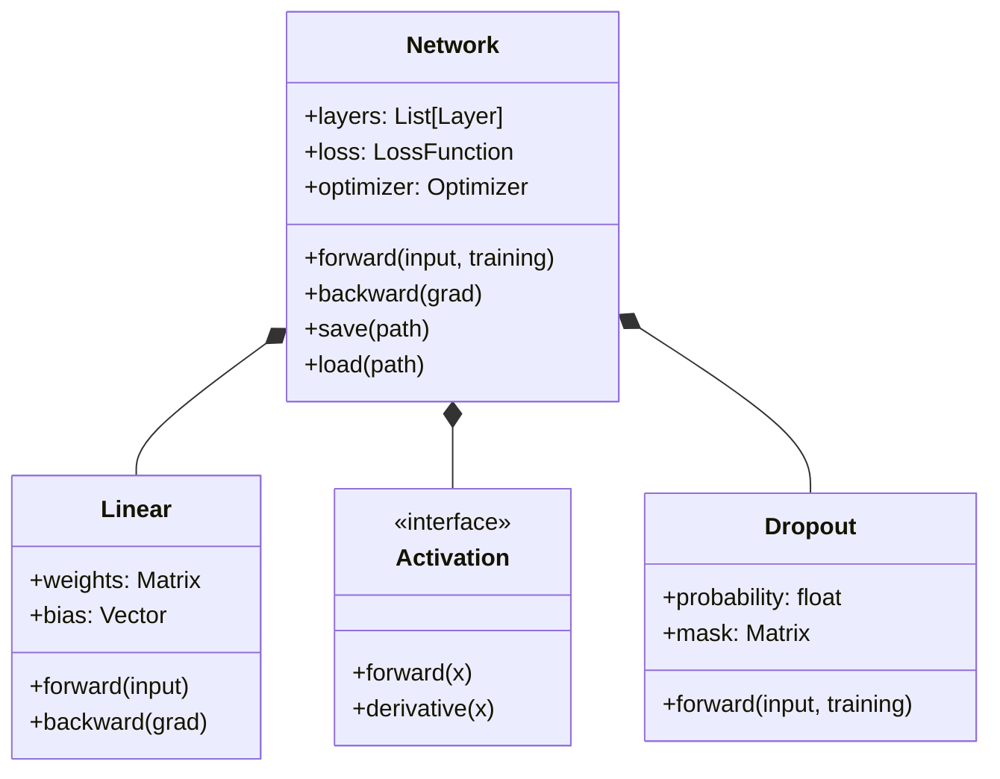

# Architecture du Moteur

L'architecture de **My_Torch** a été conçue pour être modulaire, extensible et performante. Elle repose sur le principe de "Computational Graph" séquentiel.

## Diagramme de Classe

## Le Flux d'Exécution (Pipeline)

### 1. Forward Propagation (Prédiction)
Lorsqu'une donnée entre dans le réseau, elle subit une série de transformations matricielles.
Le `Network` agit comme un conteneur qui itère sur sa liste de `layers`.

::: tip Gestion du Training Mode
Une particularité de notre architecture est la propagation du flag `training=True/False`.
Ce flag est essentiel pour la couche **Dropout**, qui doit se comporter différemment lors de l'apprentissage (désactivation aléatoire) et lors de l'inférence (transparence totale).
:::

### 2. Backward Propagation (Apprentissage)
C'est ici que réside l'intelligence. Une fois l'erreur calculée à la sortie, nous utilisons la **Règle de la Chaîne (Chain Rule)** pour remonter le réseau à l'envers. Chaque couche calcule le gradient par rapport à ses propres poids et passe le gradient restant à la couche précédente.
